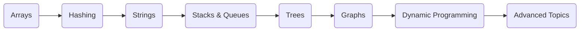

<div align="center">

# 🚀 LeetCode Journey


</div>

---

## 👨‍💻 About This Repository

This repository contains my solutions to LeetCode problems solved while studying Data Structures and Algorithms.

Most solutions are written in **C++**, with a focus on writing clean and efficient code.

---

## 🛠 Languages Used

<p align="center">
  
</p>

### 🚀 Primary Language

```cpp
#include <bits/stdc++.h>
using namespace std;

int main() {
    cout << "Solve. Analyze. Optimize.";
}
```

---

## 💡 Problem Solving Philosophy

> Understand the brute force solution first.
>
> Optimize after identifying the bottleneck.
>
> Focus on learning patterns rather than memorizing solutions.

---

## 🔥 DSA Roadmap



---

## 📊 GitHub Activity

<p align="center">
  
</p>

<p align="center">
  
</p>

---

## 🤝 Connect With Me

<p align="center">
  <a href="https://github.com/abhinav-chandrasekar995">
    
  </a>
</p>

---

# 📚 Problem List
<!---LeetCode Topics Start-->
## Array
|  |
| ------- |
| [0001-two-sum](https://github.com/abhinav-chandrasekar995/LeetCode/tree/master/0001-two-sum) |
| [0011-container-with-most-water](https://github.com/abhinav-chandrasekar995/LeetCode/tree/master/0011-container-with-most-water) |
| [0049-group-anagrams](https://github.com/abhinav-chandrasekar995/LeetCode/tree/master/0049-group-anagrams) |
| [0055-jump-game](https://github.com/abhinav-chandrasekar995/LeetCode/tree/master/0055-jump-game) |
| [0136-single-number](https://github.com/abhinav-chandrasekar995/LeetCode/tree/master/0136-single-number) |
| [0268-missing-number](https://github.com/abhinav-chandrasekar995/LeetCode/tree/master/0268-missing-number) |
| [0622-design-circular-queue](https://github.com/abhinav-chandrasekar995/LeetCode/tree/master/0622-design-circular-queue) |
| [1351-count-negative-numbers-in-a-sorted-matrix](https://github.com/abhinav-chandrasekar995/LeetCode/tree/master/1351-count-negative-numbers-in-a-sorted-matrix) |
| [1390-four-divisors](https://github.com/abhinav-chandrasekar995/LeetCode/tree/master/1390-four-divisors) |
| [1833-maximum-ice-cream-bars](https://github.com/abhinav-chandrasekar995/LeetCode/tree/master/1833-maximum-ice-cream-bars) |
| [2126-destroying-asteroids](https://github.com/abhinav-chandrasekar995/LeetCode/tree/master/2126-destroying-asteroids) |
| [3005-count-elements-with-maximum-frequency](https://github.com/abhinav-chandrasekar995/LeetCode/tree/master/3005-count-elements-with-maximum-frequency) |
| [3190-find-minimum-operations-to-make-all-elements-divisible-by-three](https://github.com/abhinav-chandrasekar995/LeetCode/tree/master/3190-find-minimum-operations-to-make-all-elements-divisible-by-three) |
| [3512-minimum-operations-to-make-array-sum-divisible-by-k](https://github.com/abhinav-chandrasekar995/LeetCode/tree/master/3512-minimum-operations-to-make-array-sum-divisible-by-k) |
## Hash Table
|  |
| ------- |
| [0001-two-sum](https://github.com/abhinav-chandrasekar995/LeetCode/tree/master/0001-two-sum) |
| [0013-roman-to-integer](https://github.com/abhinav-chandrasekar995/LeetCode/tree/master/0013-roman-to-integer) |
| [0049-group-anagrams](https://github.com/abhinav-chandrasekar995/LeetCode/tree/master/0049-group-anagrams) |
| [0268-missing-number](https://github.com/abhinav-chandrasekar995/LeetCode/tree/master/0268-missing-number) |
| [1189-maximum-number-of-balloons](https://github.com/abhinav-chandrasekar995/LeetCode/tree/master/1189-maximum-number-of-balloons) |
| [3005-count-elements-with-maximum-frequency](https://github.com/abhinav-chandrasekar995/LeetCode/tree/master/3005-count-elements-with-maximum-frequency) |
## Greedy
|  |
| ------- |
| [0011-container-with-most-water](https://github.com/abhinav-chandrasekar995/LeetCode/tree/master/0011-container-with-most-water) |
| [0055-jump-game](https://github.com/abhinav-chandrasekar995/LeetCode/tree/master/0055-jump-game) |
| [1833-maximum-ice-cream-bars](https://github.com/abhinav-chandrasekar995/LeetCode/tree/master/1833-maximum-ice-cream-bars) |
| [2126-destroying-asteroids](https://github.com/abhinav-chandrasekar995/LeetCode/tree/master/2126-destroying-asteroids) |
## Sorting
|  |
| ------- |
| [0049-group-anagrams](https://github.com/abhinav-chandrasekar995/LeetCode/tree/master/0049-group-anagrams) |
| [0268-missing-number](https://github.com/abhinav-chandrasekar995/LeetCode/tree/master/0268-missing-number) |
| [1833-maximum-ice-cream-bars](https://github.com/abhinav-chandrasekar995/LeetCode/tree/master/1833-maximum-ice-cream-bars) |
| [2126-destroying-asteroids](https://github.com/abhinav-chandrasekar995/LeetCode/tree/master/2126-destroying-asteroids) |
## Counting Sort
|  |
| ------- |
| [1189-maximum-number-of-balloons](https://github.com/abhinav-chandrasekar995/LeetCode/tree/master/1189-maximum-number-of-balloons) |
| [1833-maximum-ice-cream-bars](https://github.com/abhinav-chandrasekar995/LeetCode/tree/master/1833-maximum-ice-cream-bars) |
| [3005-count-elements-with-maximum-frequency](https://github.com/abhinav-chandrasekar995/LeetCode/tree/master/3005-count-elements-with-maximum-frequency) |
## String
|  |
| ------- |
| [0013-roman-to-integer](https://github.com/abhinav-chandrasekar995/LeetCode/tree/master/0013-roman-to-integer) |
| [0020-valid-parentheses](https://github.com/abhinav-chandrasekar995/LeetCode/tree/master/0020-valid-parentheses) |
| [0028-find-the-index-of-the-first-occurrence-in-a-string](https://github.com/abhinav-chandrasekar995/LeetCode/tree/master/0028-find-the-index-of-the-first-occurrence-in-a-string) |
| [0049-group-anagrams](https://github.com/abhinav-chandrasekar995/LeetCode/tree/master/0049-group-anagrams) |
| [0058-length-of-last-word](https://github.com/abhinav-chandrasekar995/LeetCode/tree/master/0058-length-of-last-word) |
| [0657-robot-return-to-origin](https://github.com/abhinav-chandrasekar995/LeetCode/tree/master/0657-robot-return-to-origin) |
| [1189-maximum-number-of-balloons](https://github.com/abhinav-chandrasekar995/LeetCode/tree/master/1189-maximum-number-of-balloons) |
| [2000-reverse-prefix-of-word](https://github.com/abhinav-chandrasekar995/LeetCode/tree/master/2000-reverse-prefix-of-word) |
## Math
|  |
| ------- |
| [0009-palindrome-number](https://github.com/abhinav-chandrasekar995/LeetCode/tree/master/0009-palindrome-number) |
| [0013-roman-to-integer](https://github.com/abhinav-chandrasekar995/LeetCode/tree/master/0013-roman-to-integer) |
| [0172-factorial-trailing-zeroes](https://github.com/abhinav-chandrasekar995/LeetCode/tree/master/0172-factorial-trailing-zeroes) |
| [0231-power-of-two](https://github.com/abhinav-chandrasekar995/LeetCode/tree/master/0231-power-of-two) |
| [0268-missing-number](https://github.com/abhinav-chandrasekar995/LeetCode/tree/master/0268-missing-number) |
| [0319-bulb-switcher](https://github.com/abhinav-chandrasekar995/LeetCode/tree/master/0319-bulb-switcher) |
| [0441-arranging-coins](https://github.com/abhinav-chandrasekar995/LeetCode/tree/master/0441-arranging-coins) |
| [1390-four-divisors](https://github.com/abhinav-chandrasekar995/LeetCode/tree/master/1390-four-divisors) |
| [1518-water-bottles](https://github.com/abhinav-chandrasekar995/LeetCode/tree/master/1518-water-bottles) |
| [1925-count-square-sum-triples](https://github.com/abhinav-chandrasekar995/LeetCode/tree/master/1925-count-square-sum-triples) |
| [3190-find-minimum-operations-to-make-all-elements-divisible-by-three](https://github.com/abhinav-chandrasekar995/LeetCode/tree/master/3190-find-minimum-operations-to-make-all-elements-divisible-by-three) |
| [3512-minimum-operations-to-make-array-sum-divisible-by-k](https://github.com/abhinav-chandrasekar995/LeetCode/tree/master/3512-minimum-operations-to-make-array-sum-divisible-by-k) |
## Simulation
|  |
| ------- |
| [0657-robot-return-to-origin](https://github.com/abhinav-chandrasekar995/LeetCode/tree/master/0657-robot-return-to-origin) |
| [1518-water-bottles](https://github.com/abhinav-chandrasekar995/LeetCode/tree/master/1518-water-bottles) |
## Bit Manipulation
|  |
| ------- |
| [0136-single-number](https://github.com/abhinav-chandrasekar995/LeetCode/tree/master/0136-single-number) |
| [0191-number-of-1-bits](https://github.com/abhinav-chandrasekar995/LeetCode/tree/master/0191-number-of-1-bits) |
| [0231-power-of-two](https://github.com/abhinav-chandrasekar995/LeetCode/tree/master/0231-power-of-two) |
| [0268-missing-number](https://github.com/abhinav-chandrasekar995/LeetCode/tree/master/0268-missing-number) |
## Stack
|  |
| ------- |
| [0020-valid-parentheses](https://github.com/abhinav-chandrasekar995/LeetCode/tree/master/0020-valid-parentheses) |
| [0225-implement-stack-using-queues](https://github.com/abhinav-chandrasekar995/LeetCode/tree/master/0225-implement-stack-using-queues) |
| [2000-reverse-prefix-of-word](https://github.com/abhinav-chandrasekar995/LeetCode/tree/master/2000-reverse-prefix-of-word) |
## Binary Search
|  |
| ------- |
| [0268-missing-number](https://github.com/abhinav-chandrasekar995/LeetCode/tree/master/0268-missing-number) |
| [0441-arranging-coins](https://github.com/abhinav-chandrasekar995/LeetCode/tree/master/0441-arranging-coins) |
| [1351-count-negative-numbers-in-a-sorted-matrix](https://github.com/abhinav-chandrasekar995/LeetCode/tree/master/1351-count-negative-numbers-in-a-sorted-matrix) |
## Recursion
|  |
| ------- |
| [0021-merge-two-sorted-lists](https://github.com/abhinav-chandrasekar995/LeetCode/tree/master/0021-merge-two-sorted-lists) |
| [0231-power-of-two](https://github.com/abhinav-chandrasekar995/LeetCode/tree/master/0231-power-of-two) |
## Divide and Conquer
|  |
| ------- |
| [0191-number-of-1-bits](https://github.com/abhinav-chandrasekar995/LeetCode/tree/master/0191-number-of-1-bits) |
## Two Pointers
|  |
| ------- |
| [0011-container-with-most-water](https://github.com/abhinav-chandrasekar995/LeetCode/tree/master/0011-container-with-most-water) |
| [0028-find-the-index-of-the-first-occurrence-in-a-string](https://github.com/abhinav-chandrasekar995/LeetCode/tree/master/0028-find-the-index-of-the-first-occurrence-in-a-string) |
| [2000-reverse-prefix-of-word](https://github.com/abhinav-chandrasekar995/LeetCode/tree/master/2000-reverse-prefix-of-word) |
## String Matching
|  |
| ------- |
| [0028-find-the-index-of-the-first-occurrence-in-a-string](https://github.com/abhinav-chandrasekar995/LeetCode/tree/master/0028-find-the-index-of-the-first-occurrence-in-a-string) |
## Linked List
|  |
| ------- |
| [0021-merge-two-sorted-lists](https://github.com/abhinav-chandrasekar995/LeetCode/tree/master/0021-merge-two-sorted-lists) |
| [0622-design-circular-queue](https://github.com/abhinav-chandrasekar995/LeetCode/tree/master/0622-design-circular-queue) |
## Design
|  |
| ------- |
| [0225-implement-stack-using-queues](https://github.com/abhinav-chandrasekar995/LeetCode/tree/master/0225-implement-stack-using-queues) |
| [0622-design-circular-queue](https://github.com/abhinav-chandrasekar995/LeetCode/tree/master/0622-design-circular-queue) |
## Queue
|  |
| ------- |
| [0225-implement-stack-using-queues](https://github.com/abhinav-chandrasekar995/LeetCode/tree/master/0225-implement-stack-using-queues) |
| [0622-design-circular-queue](https://github.com/abhinav-chandrasekar995/LeetCode/tree/master/0622-design-circular-queue) |
## Brainteaser
|  |
| ------- |
| [0319-bulb-switcher](https://github.com/abhinav-chandrasekar995/LeetCode/tree/master/0319-bulb-switcher) |
## Dynamic Programming
|  |
| ------- |
| [0055-jump-game](https://github.com/abhinav-chandrasekar995/LeetCode/tree/master/0055-jump-game) |
## Enumeration
|  |
| ------- |
| [1925-count-square-sum-triples](https://github.com/abhinav-chandrasekar995/LeetCode/tree/master/1925-count-square-sum-triples) |
## Matrix
|  |
| ------- |
| [1351-count-negative-numbers-in-a-sorted-matrix](https://github.com/abhinav-chandrasekar995/LeetCode/tree/master/1351-count-negative-numbers-in-a-sorted-matrix) |
<!---LeetCode Topics End-->
